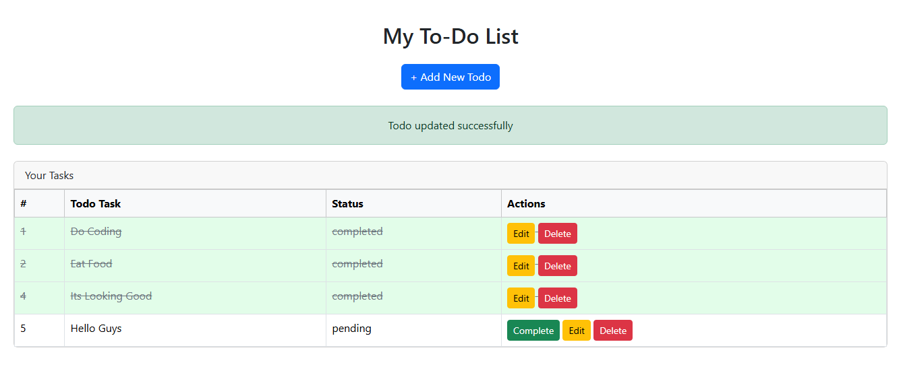

# TodoApp
Simple TodoApp with JSP and Servlets

## 🔧 Prerequisites

- Java JDK 8+
- Apache Tomcat
- Maven
- VS Code Extensions:
  - Java Extension Pack
  - Community Server Connector
  - Maven for Java

## 🚀 Steps

### 1. Build Project

Open terminal and run:

```bash
mvn clean package
```

### 2. Deploy to Tomcat

1. Press `Ctrl+Shift+P` → `Server Connector: Add Tomcat Server`
2. Press `Ctrl+Shift+P` → `Server Connector: Add Deployment` → choose WAR
3. Start the server from the Tomcat sidebar

### 3. Access in Browser

- `http://localhost:8080/TodoApp` → Servlet


## Run Default Task

- Press `Ctrl+Shift+B` to run Default Task

## SQL Query for Database
```
CREATE TABLE `todos` (
  `id` int NOT NULL,
  `title` varchar(200) NOT NULL,
  `status` varchar(10) CHARACTER SET utf8mb4 COLLATE utf8mb4_0900_ai_ci NOT NULL DEFAULT 'pending'
);


INSERT INTO `todos` (`id`, `title`, `status`) VALUES
(1, 'Do Coding', 'completed'),
(2, 'Eat Food', 'completed'),
(3, 'Its Looking Good', 'pending'),
(4, 'Hello Guys', 'pending');


ALTER TABLE `todos` ADD PRIMARY KEY (`id`);


ALTER TABLE `todos`
  MODIFY `id` int NOT NULL AUTO_INCREMENT, AUTO_INCREMENT=5;
COMMIT;
```

## Screenshots

